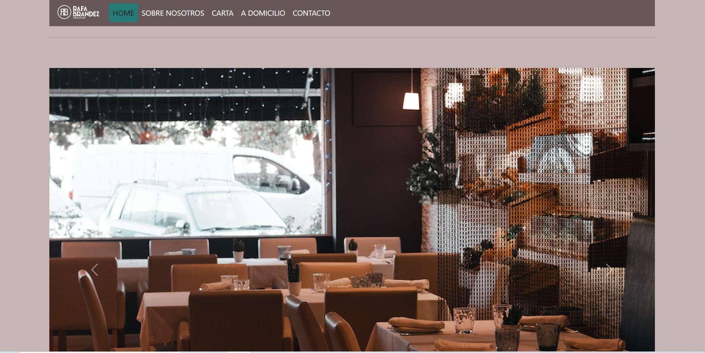
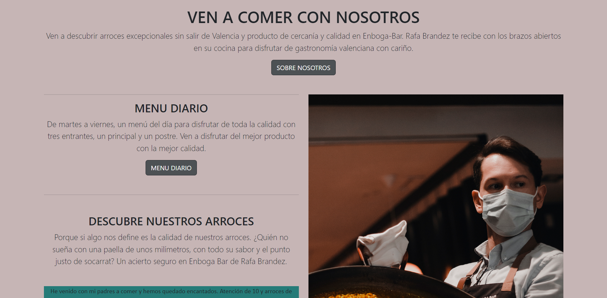
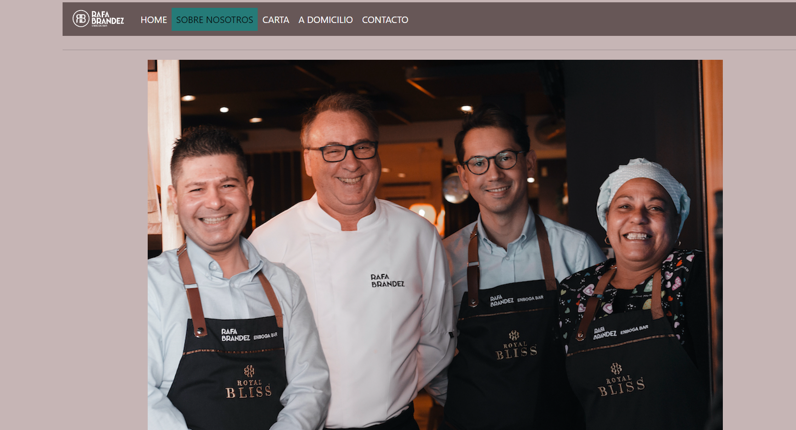
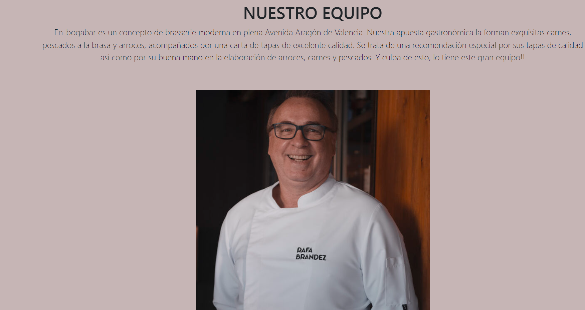
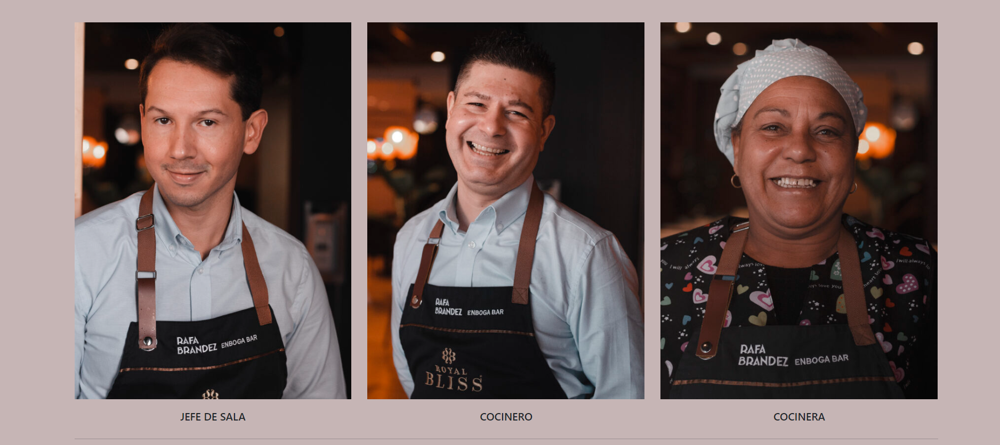
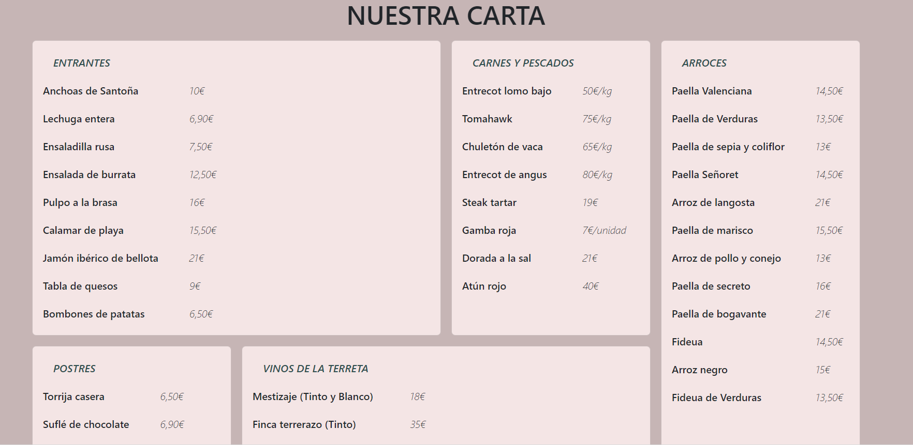
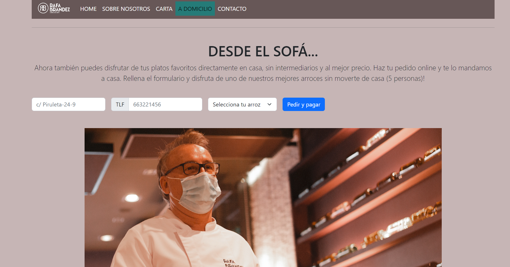
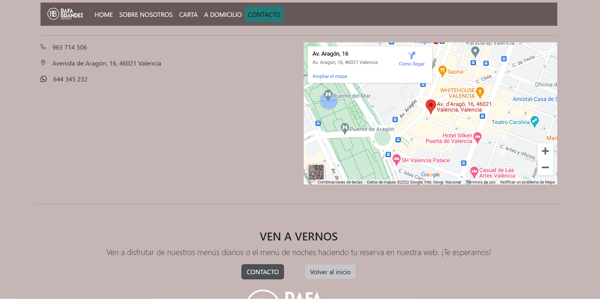

## Carta de Restaurante
![Hola]

👋 Soy Javier Moya. 
💻 Soy un FullStack Developer en  <kbd>⇥</kbd>    

### Sobre el proyecto

Este proyecto consiste en diseñar la web de un restaurante. En este caso, es la web del restaurante Enbogabar.

Para empezar, podemos ver la web principal "HOME":
 

 
Seguidamente, clicamos en "SOBRE NOSOTROS" y accedemos a la siguiente interfaz:
  

  
Presentamos a todo el equipo principal de enbogabar:
  

  

En tercer lugar, accedemos al menú del restaurante; la "CARTA":

  
Como observamos, este restaurante también tiene un apartado de comidas a domicilio. Accedemos a el clicando en "A domicilio".
  

  

Por último, accedemos a la interfaz de contacto, en la cual podemos ver la ubicación exacta del local, así como su teléfono y demás.

 

### Elaborado con:

Para este proyecto, estas son las tecnologías que han sido utilizadas:
 

 

Puedes ver este proyecto en <kbd>⇥</kbd> [GitHub pages](https://javiermoyasimo.github.io/project02-menu/ "GitHub pages")

### Créditos

Autor: JavierMoyaSimo

Última vez editado: 02/10/2022
